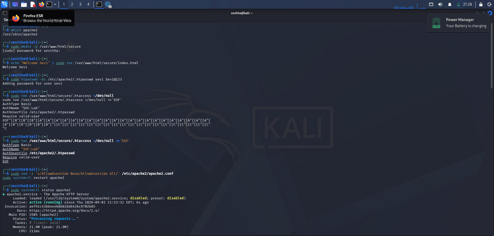
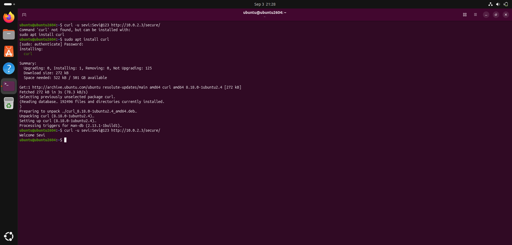
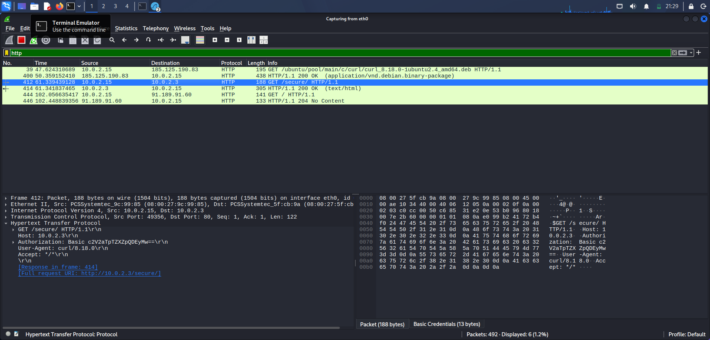
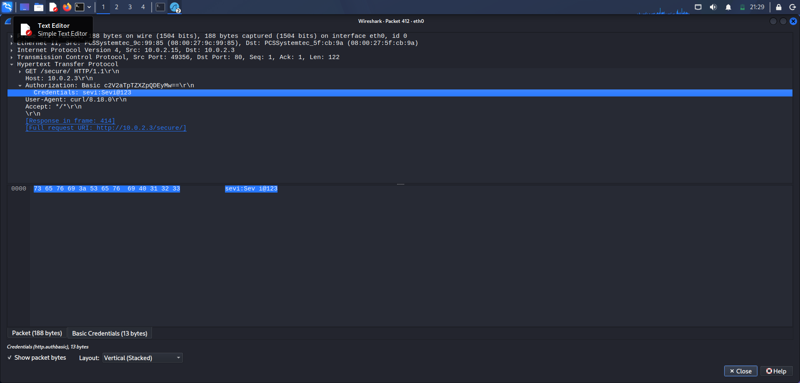

# HTTP Credential Capture

## Objective
Demonstrate how HTTP Basic Authentication exposes credentials.

---

## 1. Apache Web Server Configuration

Apache was configured with a password-protected directory.



---

## 2. Client Authentication

The Ubuntu client authenticated using curl.

```bash
curl -u sevi:Sevi@123 http://10.0.2.3/secure/
```



---

## 3. HTTP Packet Capture

Wireshark captured the HTTP GET request.



---

## 4. Credential Analysis

The Authorization header was decoded by Wireshark.

**Recovered credentials:**
- Username: `Sevi`
- Password: `Sevi@123`



---

## Detection Summary

| Field | Value |
|---|---|
| Protocol | HTTP |
| Port | 80 |
| Source | 10.0.2.15 |
| Destination | 10.0.2.3 |
| Finding | HTTP Basic credentials exposed |
