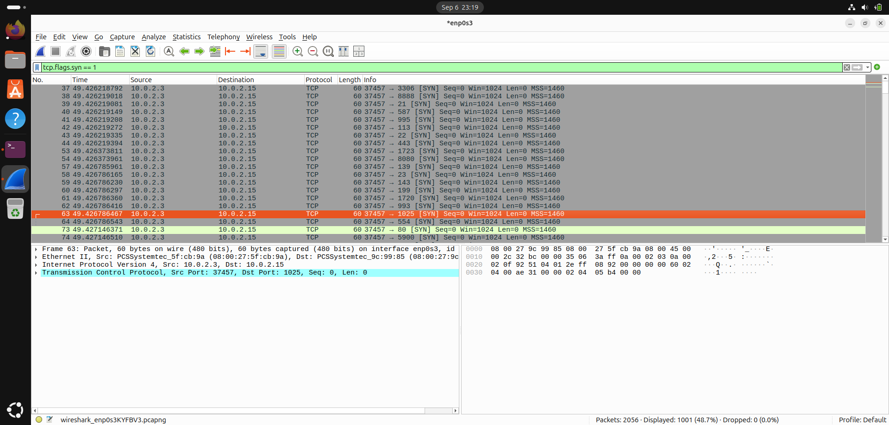
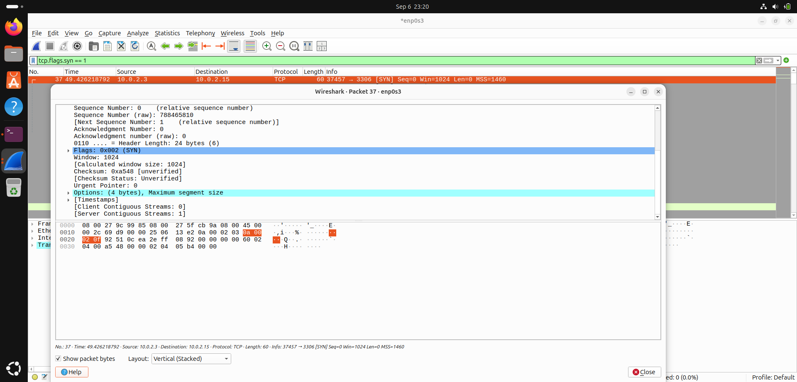
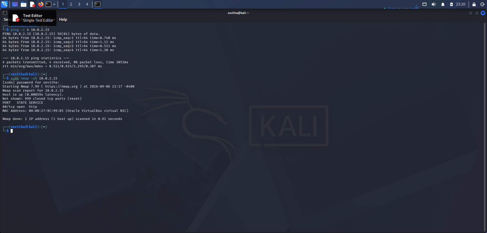

# Nmap Detection Investigation

## Objective
Detect and investigate an Nmap SYN scan using Wireshark to identify reconnaissance activity against a target host.

---

## Lab Setup

| Machine | IP Address | Role |
|----------|------------|------|
| Kali Linux | 10.0.2.3 | Attacker |
| Ubuntu | 10.0.2.15 | Victim |

---

## Tools Used

- Kali Linux
- Ubuntu
- Nmap
- Wireshark

---

## Attack Performed

Run the SYN scan from Kali:

```bash
sudo nmap -sS 10.0.2.15
```

### Command Breakdown

| Command | Purpose |
|----------|---------|
| `sudo` | Runs Nmap with administrator privileges |
| `nmap` | Network scanning tool |
| `-sS` | Performs a TCP SYN (Stealth) scan |
| `10.0.2.15` | Target victim machine |

---

## Wireshark Detection

Apply the following display filter:

```text
tcp.flags.syn == 1
```

This filter displays TCP packets with the SYN flag, allowing us to detect port scanning activity.

---

## Investigation Findings

### Who is the attacker?

**Answer:** `10.0.2.3`

The source IP sending SYN packets to multiple destination ports is identified as the attacker.

### Who is the victim?

**Answer:** `10.0.2.15`

The destination IP receiving the SYN packets is the victim host.

### Why is this reconnaissance?

This activity is reconnaissance because the attacker is probing multiple TCP ports to discover which services are available before launching an attack. No application data is exchanged; only connection attempts are made.

---

## Detection Summary

| Indicator | Value |
|-----------|-------|
| Technique | TCP SYN Scan |
| Attacker | 10.0.2.3 |
| Victim | 10.0.2.15 |
| Detection Filter | `tcp.flags.syn == 1` |
| MITRE ATT&CK | T1046 – Network Service Discovery |

---

## Screenshots

### 1. SYN packets detected in Wireshark



### 2. TCP header showing SYN flag



### 3. Nmap scan executed from Kali



---

## Key Learning

- Identified attacker and victim using packet analysis.
- Detected reconnaissance through repeated TCP SYN packets.
- Used Wireshark filters to isolate malicious scanning traffic.
- Understood how defenders recognize port scanning before exploitation.
