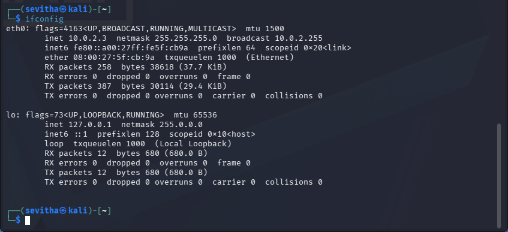
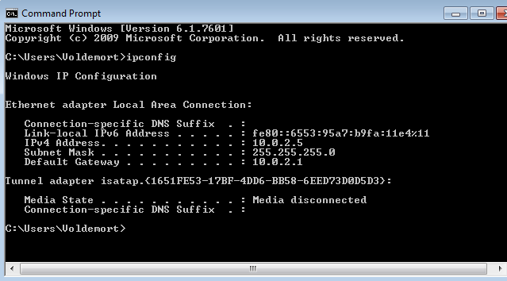
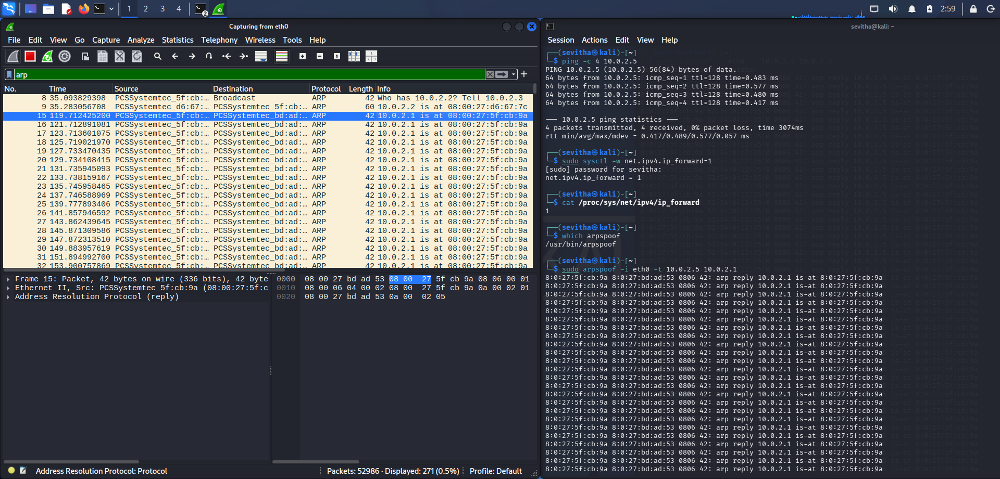
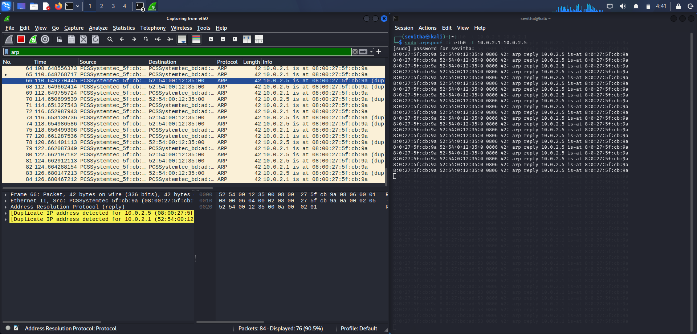
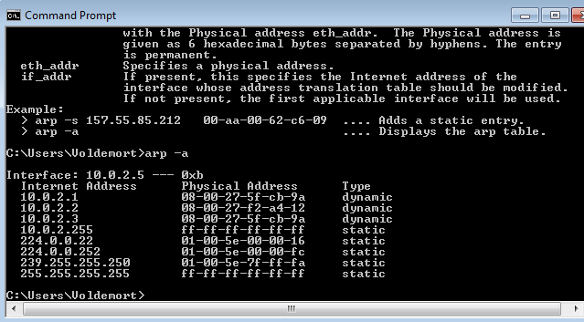

# 🛡️ ARP Spoofing Detection

## Executive Summary

A controlled ARP spoofing simulation was performed in a local laboratory to understand how forged ARP replies redirect network traffic and how the activity can be identified using Wireshark and ARP table analysis.

The objective was to detect malicious ARP behavior, verify changes in MAC address resolution, and document the investigation from a Blue Team perspective.

---

## Lab Environment

| Component | Value |
|-----------|-------|
| Operating System | Kali Linux |
| Protocol | ARP |
| Analysis Tool | Wireshark |
| Command Line Tool | arp / ip neigh |
| Environment | Local Lab |

---

## Investigation Objectives

- Capture ARP request and reply packets
- Identify forged ARP replies
- Verify MAC address changes
- Detect ARP poisoning behavior
- Document findings using MITRE ATT&CK

## Attack Simulation

A Windows 7 virtual machine acted as the victim, while Kali Linux acted as the attacker. Both systems were connected to the same VMware NAT network.

The attacker enabled IP forwarding and used `arpspoof` to send forged ARP reply packets in both directions:

- Victim (10.0.2.5) → Gateway (10.0.2.1)
- Gateway (10.0.2.1) → Victim (10.0.2.5)

This created a transparent Man-in-the-Middle (MITM) attack while maintaining network connectivity.

## Evidence Collection

### Figure 1 — Kali Network Configuration

**Observation:** Kali's `eth0` interface was configured with IP address `10.0.2.3`, establishing the attacker host used in the lab.

---

### Figure 2 — Windows Victim Configuration

**Observation:** The Windows 7 victim was configured with IP address `10.0.2.5` and default gateway `10.0.2.1`, confirming that both systems were operating on the same network.

---

### Figure 3 — ARP Spoofing Against the Gateway

**Observation:** Kali used `arpspoof` to send forged ARP replies to the Windows victim, falsely associating gateway IP `10.0.2.1` with Kali's MAC address.

---

### Figure 4 — ARP Spoofing Against the Victim

**Observation:** Kali sent forged ARP replies in the reverse direction, causing the gateway to associate the victim IP `10.0.2.5` with Kali's MAC address and establishing bidirectional MITM positioning.

---

### Figure 5 — Poisoned Windows ARP Cache

**Observation:** The Windows ARP cache mapped gateway IP `10.0.2.1` to Kali's MAC address `08-00-27-5f-cb-9a`, confirming successful ARP cache poisoning.

---

## Investigation Timeline

| Stage | Evidence |
|-------|----------|
| Kali attacker identified | `10.0.2.3` via `ifconfig` |
| Windows victim identified | `10.0.2.5` via `ipconfig` |
| ARP spoofing launched | `arpspoof` |
| Bidirectional poisoning established | Forged ARP replies |
| Victim ARP cache modified | `arp -a` |
| MITM condition confirmed | Gateway IP resolved to Kali MAC |

---

## Findings

- Successfully executed a controlled ARP spoofing attack in a VMware laboratory.
- Kali Linux acted as the attacker and Windows 7 acted as the victim.
- Forged ARP replies caused the Windows victim to associate gateway IP `10.0.2.1` with Kali's MAC address.
- Bidirectional ARP spoofing established a Man-in-the-Middle position between the victim and gateway.
- IP forwarding allowed Kali to relay traffic while preserving the original Layer 3 destination.
- The investigation demonstrates how an attacker can manipulate Layer 2 address resolution to intercept traffic.

---

## MITRE ATT&CK Mapping

| MITRE Element | Value |
|---------------|-------|
| **Tactic (Why?)** | Credential Access |
| **Technique (How?)** | T1557 — Adversary-in-the-Middle |
| **Procedure (Evidence)** | Forged ARP replies, poisoned Windows ARP cache, and bidirectional ARP spoofing using `arpspoof`. |

**Why:** The attacker positions themselves between the victim and gateway to intercept network communications.

**Evidence:** The Windows ARP table showed gateway IP `10.0.2.1` associated with Kali's MAC address, while forged ARP replies were continuously generated during the attack.

---

## Skills Demonstrated

- ARP protocol analysis
- Wireshark packet analysis
- ARP cache investigation
- Man-in-the-Middle (MITM)
- Linux networking (`ifconfig`, `ip neigh`, `sysctl`)
- ARP spoofing with `arpspoof`
- Windows network analysis (`ipconfig`, `arp -a`)
- MITRE ATT&CK mapping
- SOC investigation documentation

## MITRE ATT&CK Mapping

| Tactic | Technique | ID |
|---------|-----------|----|
| Collection | Adversary-in-the-Middle | T1557 |

**Why:** Intercept communication between the victim and the gateway.

**Evidence:** Forged ARP Reply packets in Wireshark, poisoned ARP cache on Windows, and bidirectional ARP spoofing using `arpspoof`.
