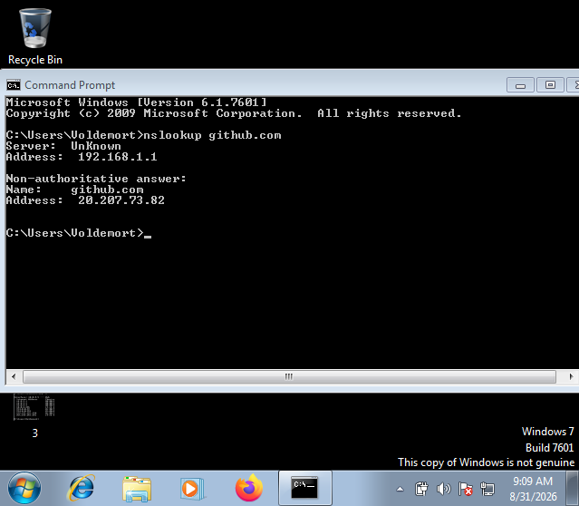

# DNS Traffic Analysis

A Blue Team investigation demonstrating how DNS resolves a domain name into an IPv4 address using Wireshark and `nslookup`.

---

## Investigation Objective

Capture and analyze DNS query and response traffic to understand:

* DNS name resolution
* A (IPv4) record lookup
* UDP port 53 communication
* DNS packet analysis in Wireshark

---

## Lab Environment

| Device     | IP Address    | Role                |
| ---------- | ------------- | ------------------- |
| Kali Linux | `10.0.2.3`    | Analyst (Wireshark) |
| Windows 7  | `10.0.2.5`    | DNS Client          |
| DNS Server | `192.168.1.1` | DNS Resolver        |

---

## Tools Used

* Wireshark
* Windows Command Prompt
* `nslookup`

---

## Investigation Steps

1. Started packet capture on **eth0** using Wireshark.
2. Applied the display filter: `dns`.
3. From Windows 7, executed:

```cmd
nslookup github.com
```

4. Captured the DNS query and corresponding response.
5. Expanded the DNS response to analyze the returned **A record**.

---

## Findings

| Item                  | Value          |
| --------------------- | -------------- |
| Domain Queried        | `github.com`   |
| DNS Server            | `192.168.1.1`  |
| Client IP             | `10.0.2.5`     |
| Protocol              | DNS            |
| Transport Protocol    | UDP            |
| Server Port           | 53             |
| Client Ephemeral Port | 50446          |
| A Record              | `20.207.73.82` |
| TTL                   | 24 seconds     |

---

# Evidence Collection

## Figure 1 — Windows DNS Lookup



**Observation:** Windows successfully queried the configured DNS server (`192.168.1.1`) to resolve `github.com` and received the IPv4 address `20.207.73.82`.

---

## Figure 2 — Wireshark DNS Query and Response


**Observation:** Wireshark captured both the **DNS Standard Query** from the client (`10.0.2.5`) and the **DNS Standard Query Response** from the DNS server (`192.168.1.1`), confirming successful DNS resolution over **UDP port 53**.

---

## Figure 3 — DNS A Record Analysis


**Observation:** The DNS response contains an **A (Host Address)** record mapping `github.com` to the IPv4 address `20.207.73.82` with a **TTL of 24 seconds**, allowing the client to temporarily cache the result.

---

# Packet Analysis

### DNS Query

| Field            | Value         |
| ---------------- | ------------- |
| Source IP        | `10.0.2.5`    |
| Destination IP   | `192.168.1.1` |
| Source Port      | 50446         |
| Destination Port | 53            |
| Record Type      | A             |

### DNS Response

| Field            | Value          |
| ---------------- | -------------- |
| Source IP        | `192.168.1.1`  |
| Destination IP   | `10.0.2.5`     |
| Source Port      | 53             |
| Destination Port | 50446          |
| Returned Address | `20.207.73.82` |

---

# SOC Analyst Notes

* DNS primarily uses **UDP port 53** for standard name resolution.
* The client initiates the request using an **ephemeral source port** (50446), while the DNS server replies from **source port 53**.
* Both **A (IPv4)** and **AAAA (IPv6)** queries were observed, which is normal Windows DNS behavior.
* The TTL value determines how long the client may cache the DNS response before performing another lookup.

---

# MITRE ATT&CK Mapping

| Tactic    | Technique                             |
| --------- | ------------------------------------- |
| Discovery | **T1046 – Network Service Discovery** |

**Reason:** This investigation focuses on analyzing DNS network traffic from a defensive monitoring perspective rather than performing an attack.

---

# Conclusion

The investigation successfully demonstrated the complete DNS name resolution process. Windows queried the DNS resolver, received an **A record** for `github.com`, and cached the result based on the returned TTL. This lab establishes a strong foundation for identifying abnormal DNS behavior, including DNS tunnelling and DNS-based data exfiltration in future investigations.
