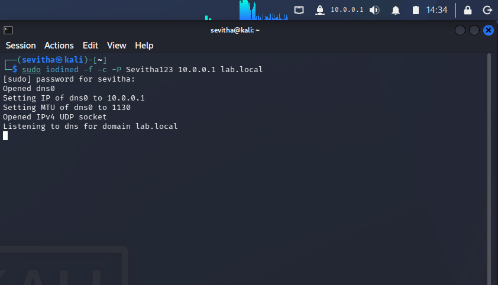

# DNS Tunnelling Detection using Iodine

> **SOC Investigation #4** | MITRE ATT&CK: **T1071.004 (DNS)**

## Objective

Simulate a DNS tunnelling attack using **Iodine**, capture the traffic in Wireshark, and identify the network indicators of covert Command & Control (C2) communication over DNS.

---

## Lab Environment

| Machine | Role | IP Address |
|----------|------|------------|
| Kali Linux | Attacker / Iodine DNS Server | `10.0.2.3` |
| Ubuntu | Victim / Iodine Client | `10.0.2.15` |
| Kali dns0 | Virtual Tunnel Interface | `10.0.0.1` |
| Ubuntu dns0 | Virtual Tunnel Interface | `10.0.0.2` |

**Network:** VirtualBox NAT Network

---

## Attack Architecture

Victim (Ubuntu)                         Attacker (Kali)
10.0.2.15                              10.0.2.3
dns0 → 10.0.0.2                        dns0 → 10.0.0.1
       │
       │  UDP 53 (DNS Tunnel)
       └────────────────────────────────────►

**Important:** The tunnel uses the virtual `10.0.0.0/24` network, while Wireshark captures the physical `10.0.2.0/24` traffic.

---

## Step 1 — Start the Iodine Server

**Kali**

```bash
sudo iodined -f -c -P Sevitha123 10.0.0.1 lab.local
```

### Screenshot



The `dns0` virtual interface was created and the server began listening for DNS tunnel connections.

---

## Step 2 — Connect the Victim

**Ubuntu**

```bash
sudo iodine -f -P Sevitha123 10.0.2.3 lab.local
```

### Screenshot


The victim successfully established a tunnel and received the virtual IP `10.0.0.2`.

---

## Step 3 — Generate Tunnel Traffic

```bash
ping -c 4 10.0.0.1
```

### Screenshot


Although the destination is `10.0.0.1`, the ICMP packets travel through the DNS tunnel created by Iodine.

---

## Step 4 — Capture the Traffic

**Wireshark Filter**

```text
dns
```

### Screenshot


Observed communication:

| Source | Destination | Protocol |
|----------|-------------|----------|
| `10.0.2.15` | `10.0.2.3` | DNS |

The physical interface captures only the DNS transport, not the virtual `10.0.0.x` addresses.

---

## Step 5 — Packet Analysis

### Screenshot


### Indicators

- UDP Destination Port **53**
- Repeated DNS packets
- Unknown DNS operation
- Malformed DNS payload
- Consistent packet sizes (136–137 bytes)

Wireshark reports **Malformed DNS** because the payload contains encapsulated tunnel data rather than a legitimate DNS query.

---

# SOC Detection Notes

**Suspicious Indicators**

- High volume of DNS requests
- Repeated communication with the same DNS server
- Non-standard DNS operations
- Consistent packet lengths
- Possible Command & Control behaviour

---

# MITRE ATT&CK Mapping

| Field | Value |
|--------|-------|
| Technique | T1071.004 |
| Name | Application Layer Protocol: DNS |
| Tactic | Command & Control |

---

# Key Learning

- `dns0` is a **virtual tunnel interface**, not the DNS server.
- Iodine encapsulates ICMP traffic inside DNS packets.
- Wireshark captures the **physical** communication (`10.0.2.15 → 10.0.2.3`) over UDP port 53.
- The virtual tunnel (`10.0.0.2 ↔ 10.0.0.1`) exists only inside Iodine.

---

## Skills Demonstrated

- DNS Traffic Analysis
- DNS Tunnelling Detection
- Wireshark Packet Inspection
- Iodine Client/Server Configuration
- Command & Control (C2) Analysis
- MITRE ATT&CK Mapping
